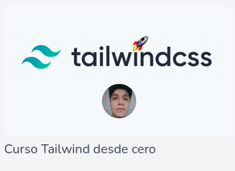

## Tailwind - Victor Arana

**Web:**
[Curso CodersFree](https://codersfree.com/courses-status/curso-tailwind-desde-cero?current_id=44)

**Carpeta:**
/home/enrique/laravel/htdocs/VictorArana/Tailwind

**Database:**
database/database.sqlite

**ScreenShot:**
 

**Documentación:**
- Cursos/Victor Arana Flores/Tailwind/Tailwind.md

**Progreso:**
<progress value="59" max="100"></progress>
- 59%

# Temario - Curso Tailwind desde cero
# Introducción
## Cómo instalar Tailwind en tu proyecto Laravel
## Como funciona grid en Tailwind
## Tipografías en tailwind (Parte 1)
## Tipografías en tailwind (Parte 2)
## Background en Tailwind
## Bordes en Tailwind
## Tablas en Tailwind
## Sizes (width and height)
# Diseño
## Layout
## Flexbox
# Crear un menu
## Como crear un menu responsivo con Tailwind
## Como volver funcional menu con Alpine

